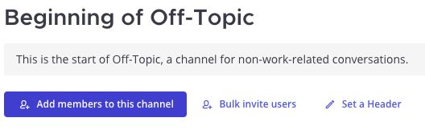
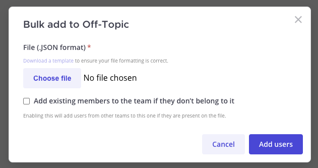
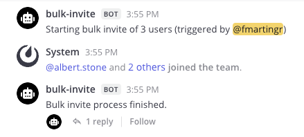

# Bulk Invite Mattermost Plugin

This plugin allows you to add users to a channel in bulk by uploading a JSON file.

## Features

- Allows adding users to a channel in bulk by uploading a JSON file.
    - Supports using `user_id` and `username`.
- (Optionally) Adds the users to the team if they don't belong to it.
- (Optionally) Invite guest users too, if provied.

## Installation

1. Clone this repository.
2. Build and upload the plugin manually:
    1. Run `make dist` to build the plugin.
    2. Go to **System Console > Plugins > Management** in your Mattermost instance
    3. Upload the plugin located in the `dist/` folder.
3. (or) Upload the plugin directly with a command:
    1. Set the environment variables:
        -  `MM_SERVICESETTINGS_SITEURL` to your Mattermost URL.
        -  `MM_ADMIN_USERNAME` to your Mattermost username.
        -  `MM_ADMIN_PASSWORD` to your Mattermost password.
    2. Run `make deploy` to build and upload the plugin.

## Usage

After successful installation:

1. Craft a JSON file following the [following format](./.readme/template.jsonc).
2. Launch the plugin from the channel header or channel intro:
    - **Channel name > Bulk Invite**

        
    - **Channel intro > Bulk Invite** (only visible to channel admins)

        

3. You will be presented with a modal where you can upload the JSON file:

    

    - **File**: Upload a JSON file following the [following format](./.readme/template.jsonc).
    - **Invite members to the team**: If checked, the users will be added to the team if they are not already members. Otherwise they will be skipped.
    - **Invite guests**: If checked, guest users on the list will be added to the channel (and team if the above is checked). Otherwise they will be skipped.

4. The plugin will display it's progress in the channel:

    

    

## Contribute

If you would like to help improve this plugin, feel free to submit a pull request.
You can also check for open issues and see if there's anything you can help with.
