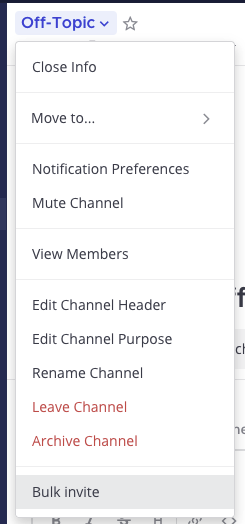

# Bulk Invite Mattermost Plugin

> **Not recommended for production use without Mattermost guidance. Please reach out to your Customer Success Manager to learn more.**

This plugin allows you to add users to a channel in bulk by uploading a JSON file.

## License

This repository is licensed under the [Mattermost Source Available License](LICENSE) and requires a valid Enterprise Edition License when used for production. See [frequently asked questions](https://docs.mattermost.com/overview/faq.html#mattermost-source-available-license) to learn more.

Although a valid Mattermost Enterprise Edition License is required if using this plugin in production, the [Mattermost Source Available License](LICENSE) allows you to compile and test this plugin in development and testing environments without a Mattermost Enterprise Edition License. As such, we welcome community contributions to this plugin.

If you're running an Enterprise Edition of Mattermost and don't already have a valid license, you can obtain a trial license from **System Console > Edition and License**. If you're running the Team Edition of Mattermost, including when you run the server directly from source, you may instead configure your server to enable both testing (`ServiceSettings.EnableTesting`) and developer mode (`ServiceSettings.EnableDeveloper`). These settings are not recommended in production environments.

## Features

- Allows adding users to a channel in bulk by uploading a JSON file.
    - Supports using `user_id` and `username`.
- (Optionally) Adds the users to the team if they don't belong to it.

## Installation

1. Clone this repository.
2. Build and upload the plugin manually:
    1. Run `make dist` to build the plugin.
    2. Go to **System Console > Plugins > Management** in your Mattermost instance
    3. Upload the plugin located in the `dist/` folder.
3. (or) Upload the plugin directly with a command:
    1. Set the environment variables:
        -  `MM_SERVICESETTINGS_SITEURL` to your Mattermost URL.
        -  `MM_ADMIN_USERNAME` to your Mattermost username.
        -  `MM_ADMIN_PASSWORD` to your Mattermost password.
    2. Run `make deploy` to build and upload the plugin.

## Usage

After successful installation:

1. Craft a JSON file following the [following format](./.readme/template.jsonc).
2. Launch the plugin from the channel header or channel intro:
    - **Channel name > Bulk Invite**

        
    - **Channel intro > Bulk Invite** (only visible to channel admins)

        

3. You will be presented with a modal where you can upload the JSON file:

    

    - **File**: Upload a JSON file following the [following format](./.readme/template.jsonc).
    - **Invite members to the team**: If checked, the users will be added to the team if they are not already members. Otherwise they will be skipped.

4. The plugin will display it's progress in the channel:

    

    

## Contribute

If you would like to help improve this plugin, feel free to submit a pull request.
You can also check for open issues and see if there's anything you can help with.
